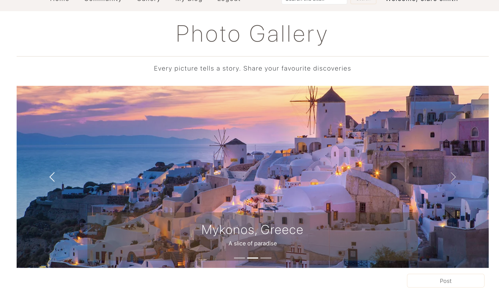
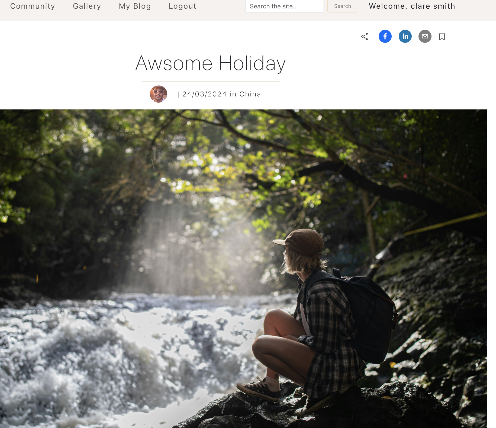

# Travel Blog by James, Mahshid, Jordan & Hayley

## About
As a passionate group of four travel and photography enthusiasts, we've created a social media app dedicated to the art of traveling.

In our app, users can share their travel experiences through posts that include a photo, country, title, and narrative, once they've logged in. The comment section enables users to engage with each other, fostering a community of travel lovers.

For those who are particularly drawn to visuals, our Gallery page focuses exclusively on showcasing breathtaking photos from around the globe.

On the My Blog page, users can personalize their profile by adding a profile photo, writing a bio, displaying a map of places they've visited, and managing their own posts. This feature allows each user to curate their travel journey in a unique and personal way.

Whether you’re looking to share your own adventures or be inspired by others', our app connects you with a vibrant community of like-minded travelers and photographers.

## Heroku deployment

To view the website, click this link: [Travel Wikkimedia](https://travel-wikkimedia-e201bd728fb6.herokuapp.com)

## Images

    
    

## Languages/ Technologies used

* JavaScript - Node.js
* Express.js
* React.js
* MongoDB & Mongoose
* APIs - Google Map, REST Country
* CSS - Bootstrap
* Heroku
*

## UX / UI

We used Bootstrap and some custom CSS to make the website look as professional as possible. Simple yet efficient and clean look has been achieved.

## Version 1.2 Improvements:
* Improvements on share buttons in the blog detail page
* Save (Favourite) feature
* Public and private feature for posts